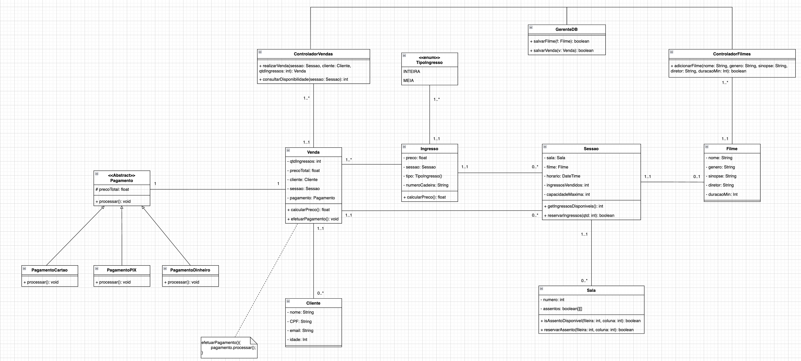

# Sistema de Gerenciamento de Cinema

## 📝 Descrição do Projeto
Sistema de reserva e venda de ingressos para cinemas, com funcionalidades como:
- Cadastro de filmes e sessões
- Reserva de assentos
- Venda de ingressos (inteira/meia)
- Controle de disponibilidade
- Processamento de pagamentos (cartão, dinheiro, PIX)

## 🏗️ Arquitetura e Padrões GRASP

### Diagrama de Classes
 

### Padrões GRASP Aplicados

#### Padrões Básicos
1. **Creator (Criador)**  
   - Aplicado em `ControladorFilmes` que cria instâncias de `Filme`
   - Aplicado em `ControladorVendas` que cria instâncias de `Venda`

2. **Controller (Controlador)**  
   - `ControladorFilmes` gerencia a lógica de criação de filmes
   - `ControladorVendas` coordena o processo de venda de ingressos

3. **Polymorphism (Polimorfismo)**  
   - Implementado na hierarquia de `Pagamento` (Cartão/Dinheiro/PIX)
   - `Ingresso` calcula preço diferentemente para meia/inteira

#### Padrões Avançados
1. **Pure Fabrication (Fabricação Pura)**  
   - `GerenteDB` como classe artificial para simular persistência
   - Centraliza operações de banco de dados que não são responsabilidade natural de outras classes

2. **Indirection (Indireção)**  
   - `ControladorVendas` atua como mediador entre `Venda`, `Sessao` e `Cliente`
   - Reduz acoplamento direto entre essas classes

## 🛠️ Tecnologias Utilizadas
- Java 
- Diagrama: draw.io

## 👥 Grupo

-  [Luma](https://github.com/lumab23)
-  [Amanda](https://github.com/Amandafonsecarodrigues)
-  [João Pedro](https://github.com/joaoamorimBM)

